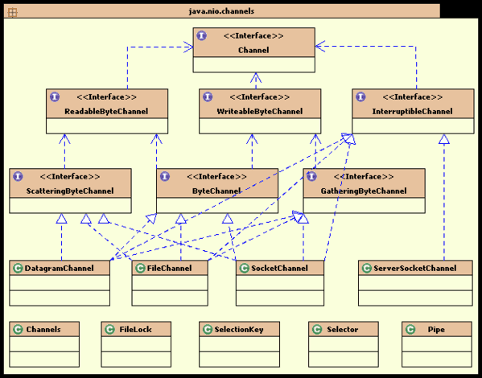

##目录
  

- 1、同步，异步，阻塞，非阻塞的理解
- 2、什么是 BIO、NIO、AIO
- 3、java NIO 常用类和方法介绍 
	- 3.1. 缓冲区 Buffer
	- 3.2. 通道 Channel
		- 3.2.1 FileChannel
		- 3.2.2 SocketChannel
		- 3.2.3 ServerSocketChannel
	- 3.3. 多路复用器（通道管理器）Selector

     

## 一、同步，异步，阻塞，非阻塞的理解

　在介绍之前，我们先花点时间弄清楚几个基本的概念，同步，异步，阻塞，非阻塞。

<table style="margin:20px; padding:0px; border-collapse:collapse; border-spacing:0px; font-size:13px">
<tbody>
<tr>
<td>编号</td>
<td>名词</td>
<td>解释</td>
<td>举例</td>
</tr>
<tr>
<td>1</td>
<td>同步</td>
<td>指的是用户进程触发IO操作并等待（阻塞）或者轮询（非阻塞）的去查看IO操作是否就绪</td>
<td>自己亲自出马持银行卡到银行取钱</td>
</tr>
<tr>
<td>2</td>
<td>异步</td>
<td>异步是指用户进程触发IO操作以后便开始做自己的事情，而当IO操作已经完成的时候会得到IO完成的通知（<strong>异步的特点就是通知</strong>）</td>
<td>委托一小弟拿银行卡到银行取钱，然后给你（使用异步IO时，Java将IO读写委托给OS处理，需要将数据缓冲区地址和大小传给OS(银行卡和密码)，OS需要支持异步IO操作API）</td>
</tr>
<tr>
<td>3</td>
<td>阻塞</td>
<td>所谓阻塞方式的意思是指, 当试图对该文件描述符进行读写时, 如果当时没有东西可读,或者暂时不可写, 程序就进入等待状态, 直到有东西可读或者可写为止</td>
<td>ATM排队取款，你只能等待（使用阻塞IO时，Java调用会一直阻塞到读写完成才返回）</td>
</tr>
<tr>
<td>4</td>
<td>非阻塞</td>
<td>非阻塞状态下, 如果没有东西可读, 或者不可写, 读写函数马上返回, 而不会等待，</td>
<td>柜台取款，取个号，然后坐在椅子上做其它事，等号广播会通知你办理，没到号你就不能去，你可以不断问大堂经理排到了没有，大堂经理如果说还没到你就不能去（使用非阻塞IO时，如果不能读写Java调用会马上返回，当IO事件分发器会通知可读写时再继续进行读写，不断循环直到读写完成）
</td>
</tr>
</tbody>
</table>

1. 同步指的是用户进程触发IO操作并等待或者轮询的去查看IO操作是否就绪，而异步是指用户进程触发IO操作以后便开始做自己的事情，而当IO操作已经完成的时候会得到IO完成的通知。

2. 阻塞和非阻塞是针对于进程在访问数据的时候，根据IO操作的就绪状态来采取的不同方式，说白了是一种读取或者写入操作函数的实现方式，阻塞方式下读取或者写入函数将一直等待，而非阻塞方式下，读取或者写入函数会立即返回一个状态值。 

　**本质上来说，同步异步、阻塞非阻塞不是同一种概念，同步和异步是消息的通知机制的概念，阻塞非阻塞是指进程的状态 。**

----------

## 二、什么是 BIO、NIO、AIO

下面我们再来举个例子来理解组合方式的IO类型：

**举例一、**如果你想吃一份宫保鸡丁盖饭： 

同步阻塞：你到饭馆点餐，然后在那等着，还要一边喊：好了没啊！ 

同步非阻塞：在饭馆点完餐，就去遛狗了。不过溜一会儿，就回饭馆喊一声：好了没啊！ 

异步阻塞：遛狗的时候，接到饭馆电话，说饭做好了，让您亲自去拿。 

异步非阻塞：饭馆打电话说，我们知道您的位置，一会给你送过来，安心遛狗就可以了。 

 

IO的方式通常分为几种，同步阻塞的BIO、同步非阻塞的NIO、异步非阻塞的AIO。

**举例二、**有一个经典的举例。烧开水。

假设有这么一个场景，有一排水壶（客户）在烧水。

AIO的做法是，每个水壶上装一个开关，当水开了以后会提醒对应的线程去处理。

NIO的做法是，叫一个线程不停的循环观察每一个水壶，根据每个水壶当前的状态去处理。

BIO的做法是，叫一个线程停留在一个水壶那，直到这个水壶烧开，才去处理下一个水壶。

可以看出AIO是最聪明省力，NIO相对省力，叫一个人就能看所有的壶，BIO最愚蠢，劳动力低下。

### 1. BIO同步阻塞IO

从程序上来说，就是当发起IO的读/写的操作时，均为阻塞方式，只有当读到了流或将流写入操作系统后，才会释放资源。

在这个模型中，用户级别的应用程序执行一个系统调用，这会导致应用程序阻塞。这意味着应用程序会一直阻塞，直到系统调用完成为止（数据传输完成或发生错误）。调用应用程序处于一种不再消费 CPU 而只是简单等待响应的状态。

java BIO 服务器实现模式为一个连接一个线程，即客户端有连接请求时服务器端就需要启动一个线程进行处理，如果客户端出现延时等异常，线程可能会被占用很长时间。此时，如果客户端数量众多，可能会消耗大量的系统资源。 

BIO方式适用于连接数目比较小且固定的架构，这种方式对服务器资源要求比较高，并发局限于应用中，但程序直观简单易理解。

**示例代码**

	import java.io.IOException;
	import java.io.InputStream;
	import java.net.ServerSocket;
	import java.net.Socket;
	import java.util.concurrent.ExecutorService;
	import java.util.concurrent.Executors;
	
	/**
	 * 传统socket服务端
	 *
	 */
	public class OioServer {
	
		@SuppressWarnings("resource")
		public static void main(String[] args) throws Exception {
	
			ExecutorService newCachedThreadPool = Executors.newCachedThreadPool();
			// 创建socket服务,监听10101端口
			ServerSocket server = new ServerSocket(10101);
			System.out.println("服务器启动！");
			while (!Thread.currentThread().isInterrupted()) {
				// 获取一个套接字（阻塞）
				final Socket socket = server.accept();
				System.out.println("来个一个新客户端！");
				newCachedThreadPool.execute(new Runnable() {
					@Override
					public void run() {
						// 业务处理
						handler(socket);
					}
				});
	
			}
		}
	
		/**
		 * 读取数据
		 * 
		 * @param socket
		 * @throws Exception
		 */
		public static void handler(Socket socket) {
			try {
				byte[] bytes = new byte[1024];
				InputStream inputStream = socket.getInputStream();
	
				while (!Thread.currentThread().isInterrupted() && !socket.isClosed()) {
					// 读取数据（阻塞）
					int read = inputStream.read(bytes);
					if (read != -1) {
						System.out.println(new String(bytes, 0, read));
					} else {
						break;
					}
				}
			} catch (Exception e) {
				e.printStackTrace();
			} finally {
				try {
					System.out.println("socket关闭");
					socket.close();
				} catch (IOException e) {
					e.printStackTrace();
				}
			}
		}
	}

### 2. NIO同步非阻塞IO

在此种方式下，用户进程发起一个IO操作以后便可返回做其它事情，但是用户进程需要时不时的询问IO操作是否就绪，这就要求用户进程不停的去询问，从而引入不必要的CPU资源浪费。其中目前JAVA的NIO就属于同步非阻塞IO。 

NIO是基于事件驱动思想的，实现上通常采用Reactor模式，从程序角度而言，当发起IO的读或写操作时，是非阻塞的；当socket有流可读或可写入socket时，操作系统会相应的通知引用程序进行处理，应用再将流读取到缓冲区或写入操作系统。对于网络IO而言，主要有连接建立、流读取及流写入三种事件、linux2.6以后的版本使用epoll方式实现NIO。

select/epoll的好处就在于单个process就可以同时处理多个网络连接的IO。然而必须指出的是因为这里需要使用两个system call (select 和 recvfrom)，而blocking IO只调用了一个system call (recvfrom)，所以某些场景下性能可能还要更差一些。但是，用select/epoll的优势在于它可以同时处理多个connection。

NIO方式适用于连接数目多且连接比较短（轻操作）的架构，比如聊天服务器，并发局限于应用中，编程比较复杂。

**演示代码:**	
	
服务端：

	import java.io.IOException;  
	import java.net.InetSocketAddress;  
	import java.net.ServerSocket;  
	import java.nio.ByteBuffer;  
	import java.nio.channels.SelectionKey;  
	import java.nio.channels.Selector;  
	import java.nio.channels.ServerSocketChannel;  
	import java.nio.channels.SocketChannel;  
	import java.util.Iterator;  
	import java.util.Set;  
	 
	public class NIOServer {  
	      
	    /*标识数字*/ 
	    private  int flag = 0;  
	    /*缓冲区大小*/ 
	    private  int BLOCK = 4096;  
	    /*接受数据缓冲区*/ 
	    private  ByteBuffer sendbuffer = ByteBuffer.allocate(BLOCK);  
	    /*发送数据缓冲区*/ 
	    private  ByteBuffer receivebuffer = ByteBuffer.allocate(BLOCK);  
	    private  Selector selector;  
	 
	    public NIOServer(int port) throws IOException {  
	        // 获得一个ServerSocket通道   
	        ServerSocketChannel serverSocketChannel = ServerSocketChannel.open();  
	        // 配置为非阻塞  
	        serverSocketChannel.configureBlocking(false);  
	        // 将该通道对应的ServerSocket绑定到port端口   
	        ServerSocket serverSocket = serverSocketChannel.socket();  
	        serverSocket.bind(new InetSocketAddress(port));  
	        // 获得一个通道管理器  
	        selector = Selector.open();  
			// 将通道管理器和该通道绑定，并为该通道注册SelectionKey.OP_ACCEPT事件,注册该事件后，
	        // 当该事件到达时，selector.select()会返回，如果该事件没到达selector.select()会一直阻塞。 
	        serverSocketChannel.register(selector, SelectionKey.OP_ACCEPT);  
	        System.out.println("Server Start----8888:");  
	    }  
	 
	 
	    // 监听  
	    private void listen() throws IOException {
			//采用轮询的方式监听selector上是否有需要处理的事件，如果有，则进行处理 。  
	        while (true) {  
	            // 当注册的事件到达时，方法返回；否则,该方法会一直阻塞   
	            selector.select();  
	            // 获得selector中选中项，项为注册的事件  
	            Set<SelectionKey> selectionKeys = selector.selectedKeys();  
	            Iterator<SelectionKey> iterator = selectionKeys.iterator();
  
	            while (iterator.hasNext()) {          
	                SelectionKey selectionKey = iterator.next();  
					//删除已选的key,以防重复处理
	                iterator.remove();  
	                handleKey(selectionKey);  
	            }  
	        }  
	    }  
	 
	    // 处理请求  
	    private void handleKey(SelectionKey selectionKey) throws IOException {  
	        // 接受请求  
	        ServerSocketChannel server = null;  
	        SocketChannel client = null;  
	        String receiveText;  
	        String sendText;  
	        int count=0;  
	        // 客户端请求连接事件    
	        if (selectionKey.isAcceptable()) {  
	            // 获得和客户端连接的通道  
	            server = (ServerSocketChannel) selectionKey.channel();    
	            client = server.accept();  
	            // 配置为非阻塞  
	            client.configureBlocking(false);  
	            // 在和客户端连接成功之后，为了可以接收到客户端的信息，需要给通道设置读的权限。
	            client.register(selector, SelectionKey.OP_READ);  
	        } else if (selectionKey.isReadable()) {  // 获得了可读的事件 
	            // 服务器可读取消息:得到事件发生的Socket通道    
	            client = (SocketChannel) selectionKey.channel();  
	            //将缓冲区清空以备下次读取  
	            receivebuffer.clear();  
	            //读取服务器发送来的数据到缓冲区中  
	            count = client.read(receivebuffer);   
	            if (count > 0) {  
	                receiveText = new String( receivebuffer.array(),0,count);  
	                System.out.println("服务器端接受客户端数据--:"+receiveText);  
	                client.register(selector, SelectionKey.OP_WRITE);  
	            }  
	        } else if (selectionKey.isWritable()) {  
	            //将缓冲区清空以备下次写入  
	            sendbuffer.clear();  
	            // 服务器可写消息:得到事件发生的Socket通道   
	            client = (SocketChannel) selectionKey.channel();  
	            sendText="message from server--" + flag++;  
	            //向缓冲区中输入数据  
	            sendbuffer.put(sendText.getBytes());  
	             //将缓冲区各标志复位,因为向里面put了数据，标志被改变要想从中读取数据发向服务器,就要复位  
	            sendbuffer.flip();  
	            //输出到通道  
	            client.write(sendbuffer);  
	            System.out.println("服务器端向客户端发送数据--："+sendText);  
	            client.register(selector, SelectionKey.OP_READ);  
	        }  
	    }  
	 
	    /**  
	     * @param args  
	     * @throws IOException  
	     */ 
	    public static void main(String[] args) throws IOException {  
	        // TODO Auto-generated method stub  
	        int port = 8888;  
	        NIOServer server = new NIOServer(port);  
	        server.listen();  
	    }  
	} 

客户端
	
	import java.io.IOException;  
	import java.net.InetSocketAddress;  
	import java.nio.ByteBuffer;  
	import java.nio.channels.SelectionKey;  
	import java.nio.channels.Selector;  
	import java.nio.channels.SocketChannel;  
	import java.util.Iterator;  
	import java.util.Set;  
	 
	public class NIOClient {  
	 
	    /*标识数字*/ 
	    private static int flag = 0;  
	    /*缓冲区大小*/ 
	    private static int BLOCK = 4096;  
	    /*接受数据缓冲区*/ 
	    private static ByteBuffer sendbuffer = ByteBuffer.allocate(BLOCK);  
	    /*发送数据缓冲区*/ 
	    private static ByteBuffer receivebuffer = ByteBuffer.allocate(BLOCK);  
	    /*服务器端地址*/ 
	    private final static InetSocketAddress SERVER_ADDRESS = new InetSocketAddress(  
	            "localhost", 1111);  
	 
	    public static void main(String[] args) throws IOException {    
	        // 打开socket通道  
	        SocketChannel socketChannel = SocketChannel.open();  
	        // 设置为非阻塞方式  
	        socketChannel.configureBlocking(false);  
	        // 打开选择器  
	        Selector selector = Selector.open();  
	        // 注册连接服务端socket动作  
	        socketChannel.register(selector, SelectionKey.OP_CONNECT);  
	        // 连接  
	        socketChannel.connect(SERVER_ADDRESS);  
	        // 分配缓冲区大小内存  
	          
	        Set<SelectionKey> selectionKeys;  
	        Iterator<SelectionKey> iterator;  
	        SelectionKey selectionKey;  
	        SocketChannel client;  
	        String receiveText;  
	        String sendText;  
	        int count=0;  
	 
	        while (true) {  
	            // 这个方法会一直阻塞到某个注册的通道有事件就绪 
	            selector.select();  
	            // 返回此选择器的已选择键集。  
	            selectionKeys = selector.selectedKeys();  
	            //System.out.println(selectionKeys.size());  
	            iterator = selectionKeys.iterator();  
	            while (iterator.hasNext()) {  
	                selectionKey = iterator.next();  
	                if (selectionKey.isConnectable()) {  
	                    System.out.println("client connect");  
	                    client = (SocketChannel) selectionKey.channel();  
	                    // 判断此通道上是否正在进行连接操作。  
	                    // 完成套接字通道的连接过程。  
	                    if (client.isConnectionPending()) {  
	                        client.finishConnect();  
	                        System.out.println("完成连接!");  
	                        sendbuffer.clear();  
	                        sendbuffer.put("Hello,Server".getBytes());  
	                        sendbuffer.flip();  
	                        client.write(sendbuffer);  
	                    }  
	                    client.register(selector, SelectionKey.OP_READ);  
	                } else if (selectionKey.isReadable()) {  
	                    client = (SocketChannel) selectionKey.channel();  
	                    //将缓冲区清空以备下次读取  
	                    receivebuffer.clear();  
	                    //读取服务器发送来的数据到缓冲区中  
	                    count=client.read(receivebuffer);  
	                    if(count>0){  
	                        receiveText = new String( receivebuffer.array(),0,count);  
	                        System.out.println("客户端接受服务器端数据--:"+receiveText);  
	                        client.register(selector, SelectionKey.OP_WRITE);  
	                    }  
	 
	                } else if (selectionKey.isWritable()) {  
	                    sendbuffer.clear();  
	                    client = (SocketChannel) selectionKey.channel();  
	                    sendText = "message from client--" + (flag++);  
	                    sendbuffer.put(sendText.getBytes());  
	                     //将缓冲区各标志复位,因为向里面put了数据标志被改变要想从中读取数据发向服务器,就要复位  
	                    sendbuffer.flip();  
	                    client.write(sendbuffer);  
	                    System.out.println("客户端向服务器端发送数据--："+sendText);  
	                    client.register(selector, SelectionKey.OP_READ);  
	                }  
	            }  
	            selectionKeys.clear();  
	        }  
	    }  
	} 
	

### 3. AIO异步非阻塞

AIO为异步IO方式，此种方式下是指应用发起一个IO操作以后，不等待内核IO操作的完成，等内核完成IO操作以后会通知应用程序。

AIO同样基于事件驱动思想，实现上通常采用Proactor模式。从程序的角度而言，与NIO不同，当进行读写操作时，只须直接调用API的read或write方法即可。这两种方法均为异步的，对于读操作而言，当有流可读取时，操作系统会将可读的流传入read方法的缓冲区，并通知应用程序；对于写操作而言，当操作系统将write方法传递的流写入完毕时，操作系统主动通知应用程序。较之NIO而言，AIO一方面简化了程序的编写，流的读取和写入都由操作系统来代替完成；另一方面省去了NIO中程序要遍历事件通知队列（selector）的代价。

AIO方式使用于连接数目多且连接比较长（重操作）的架构，比如相册服务器，充分调用OS参与并发操作，编程比较复杂。 

以上几种通信模型，广泛应用于各个通信框架中，jdk1.6及之前的版本都只实现BIO 和 NIO直到jdk1.7开始支持AIO，即NIO 2.0。因此目前很多Java项目都只停留在NIO，还没有使用AIO。

在AIO socket编程中，服务端通道是AsynchronousServerSocketChannel，这个类提供了一个open()静态工厂，一个bind()方法用于绑定服务端IP地址（还有端口号），另外还提供了accept()用于接收用户连接请求。在客户端使用的通道是AsynchronousSocketChannel,这个通道处理提供open静态工厂方法外，还提供了read和write方法。
在AIO编程中，发出一个事件（accept read write等）之后要指定事件处理类（回调函数），AIO中的事件处理类是CompletionHandler<V,A>，这个接口定义了如下两个方法，分别在异步操作成功和失败时被回调。  
   
	void completed(V result, A attachment);  
	void failed(Throwable exc, A attachment);

**示例代码**

服务端

	import java.io.IOException;  
	import java.net.InetSocketAddress;  
	import java.nio.ByteBuffer;  
	import java.nio.channels.AsynchronousServerSocketChannel;  
	import java.nio.channels.AsynchronousSocketChannel;  
	import java.nio.channels.CompletionHandler;  
	import java.util.concurrent.ExecutionException;  
	import java.util.concurrent.Future;  
	import java.util.concurrent.TimeUnit;  
	import java.util.concurrent.TimeoutException;  
	  
	public class AIOEchoServer {  
	  
	    public final static int PORT = 8001;  
	    public final static String IP = "127.0.0.1";  
	  
	      
	    private AsynchronousServerSocketChannel server = null;  
	      
	    public AIOEchoServer(){  
	        try {  
	            //同样是利用工厂方法产生一个通道，异步通道 AsynchronousServerSocketChannel  
	            server = AsynchronousServerSocketChannel.open().bind(new InetSocketAddress(IP,PORT));  
	        } catch (IOException e) {  
	            e.printStackTrace();  
	        }  
	    }  
	      
	    //使用这个通道(server)来进行客户端的接收和处理  
	    public void start(){  
	        System.out.println("Server listen on "+PORT);  
	          
	        //注册事件和事件完成后的处理器，这个CompletionHandler就是事件完成后的处理器  
	        server.accept(null,new CompletionHandler<AsynchronousSocketChannel,Object>(){  
	  
	            final ByteBuffer buffer = ByteBuffer.allocate(1024);  
	              
	            @Override  
	            public void completed(AsynchronousSocketChannel result,Object attachment) {  
	                  
	                System.out.println(Thread.currentThread().getName());  
	                Future<Integer> writeResult = null;  
	                  
	                try{  
	                    buffer.clear();  
	                    result.read(buffer).get(100,TimeUnit.SECONDS);  
	                      
	                    System.out.println("In server: "+ new String(buffer.array()));  
	                      
	                    //将数据写回客户端  
	                    buffer.flip();  
	                    writeResult = result.write(buffer);  
	                }catch(InterruptedException | ExecutionException | TimeoutException e){  
	                    e.printStackTrace();  
	                }finally{  
	                    server.accept(null,this);  
	                    try {  
	                        writeResult.get();  
	                        result.close();  
	                    } catch (InterruptedException | ExecutionException e) {  
	                        e.printStackTrace();  
	                    } catch (IOException e) {  
	                        e.printStackTrace();  
	                    }  
	                }  
	                  
	            }  
	  
	            @Override  
	            public void failed(Throwable exc, Object attachment) {  
	                System.out.println("failed:"+exc);  
	            }  
	              
	        });  
	    }  
	      
	    public static void main(String[] args) {  
	        new AIOEchoServer().start();  
	        while(true){  
	            try {  
	                Thread.sleep(1000);  
	            } catch (InterruptedException e) {  
	                e.printStackTrace();  
	            }  
	        }  
	    }  
	  
	}  
	
客户端：

	
	import java.io.IOException;  
	import java.net.InetSocketAddress;  
	import java.nio.ByteBuffer;  
	import java.nio.channels.AsynchronousSocketChannel;  
	import java.nio.channels.CompletionHandler;  
	  
	public class AIOClient {  
	  
	    public static void main(String[] args) throws IOException {  
	          
	        final AsynchronousSocketChannel client = AsynchronousSocketChannel.open();  
	          
	        InetSocketAddress serverAddress = new InetSocketAddress("127.0.0.1",8001);  
	          
	        CompletionHandler<Void, ? super Object> handler = new CompletionHandler<Void,Object>(){  
	  
	            @Override  
	            public void completed(Void result, Object attachment) {  
	                client.write(ByteBuffer.wrap("Hello".getBytes()),null,   
	                        new CompletionHandler<Integer,Object>(){  
	  
	                            @Override  
	                            public void completed(Integer result,  
	                                    Object attachment) {  
	                                final ByteBuffer buffer = ByteBuffer.allocate(1024);  
	                                client.read(buffer,buffer,new CompletionHandler<Integer,ByteBuffer>(){  
	  
	                                    @Override  
	                                    public void completed(Integer result,  
	                                            ByteBuffer attachment) {  
	                                        buffer.flip();  
	                                        System.out.println(new String(buffer.array()));  
	                                        try {  
	                                            client.close();  
	                                        } catch (IOException e) {  
	                                            e.printStackTrace();  
	                                        }  
	                                    }  
	  
	                                    @Override  
	                                    public void failed(Throwable exc,  
	                                            ByteBuffer attachment) {  
	                                    }  
	                                      
	                                });  
	                            }  
	  
	                            @Override  
	                            public void failed(Throwable exc, Object attachment) {  
	                            }  
	                      
	                });  
	            }  
	  
	            @Override  
	            public void failed(Throwable exc, Object attachment) {  
	            }  
	              
	        };  
	          
	        client.connect(serverAddress, null, handler);  
	        try {  
	            Thread.sleep(1000);  
	        } catch (InterruptedException e) {  
	            e.printStackTrace();  
	        }  
	    }  
	  
	}  

**总结:**

注：伪异步IO是指BIO+线程池的方式实现IO方式

##三、java NIO 常用类和方法介绍 

### 1. 缓冲区 Buffer

Buffer是一个对象，包含一些要写入或者读出的数据。

在NIO库中，所有数据都是用缓冲区处理的。在读取数据时，它是直接读到缓冲区中的；在写入数据时，也是写入到缓冲区中。任何时候访问NIO中的数据，都是通过缓冲区进行操作。

缓冲区实际上是一个数组，并提供了对数据结构化访问以及维护读写位置等信息。

具体的缓存区有这些：ByteBuffe、CharBuffer、 ShortBuffer、IntBuffer、LongBuffer、FloatBuffer、DoubleBuffer。他们实现了相同的接口：Buffer。

 

- **Buffer 的基本用法**

当向buffer写入数据时，buffer会记录下写了多少数据。一旦要读取数据，需要通过flip()方法将Buffer从写模式切换到读模式。在读模式下，可以读取之前写入到buffer的所有数据。
一旦读完了所有的数据，就需要清空缓冲区，让它可以再次被写入。有两种方式能清空缓冲区：调用clear()或compact()方法。clear()方法会清空整个缓冲区。compact()方法只会清除已经读过的数据。任何未读的数据都被移到缓冲区的起始处，新写入的数据将放到缓冲区未读数据的后面。

- **Buffer 工作原理**

如果想要理解Buffer的工作原理只需需要理解三个属性的含义就够了，capacity：内存容量,position：位置，limit：实际有效数据的位置

Buffer 重要的几个方法：

- **allocate方法**

要想获得一个Buffer对象首先要进行分配

	//创建一个分配48字节capacity的ByteBuffer的对象
	ByteBuffer buf = ByteBuffer.allocate(48);

- **向Buffer中写数据**

写数据到Buffer有两种方式：

从Channel写到Buffer的例子

	int bytesRead = inChannel.read(buf); 

通过put方法写Buffer的例子：

	buf.put(127);

- **flip()方法**

flip方法将Buffer从写模式切换到读模式。调用flip()方法会将position设回0，并将limit设置成之前position的值。

换句话说，position现在用于标记读的位置，limit表示之前写进了多少个byte、char等 —— 现在能读取多少个byte、char等。

- **从Buffer中读取数据**

从Buffer中读取数据有两种方式：

从Buffer读取数据到Channel的例子：

	int bytesWritten = inChannel.write(buf);

使用get()方法从Buffer中读取数据的例子

	byte aByte = buf.get();

- **rewind()方法**

Buffer.rewind()将position设回0，所以你可以重读Buffer中的所有数据。limit保持不变，仍然表示能从Buffer中读取多少个元素（byte、char等）。

- **clear()与compact()方法**

一旦读完Buffer中的数据，需要让Buffer准备好再次被写入。可以通过clear()或compact()方法来完成。

如果调用的是clear()方法，position将被设回0，limit被设置成 capacity的值。换句话说，Buffer 被清空了。Buffer中的数据并未清除，只是这些标记告诉我们可以从哪里开始往Buffer里写数据。

如果Buffer中有一些未读的数据，调用clear()方法，数据将“被遗忘”，意味着不再有任何标记会告诉你哪些数据被读过，哪些还没有。

如果Buffer中仍有未读的数据，且后续还需要这些数据，但是此时想要先先写些数据，那么使用compact()方法。

compact()方法将所有未读的数据拷贝到Buffer起始处。然后将position设到最后一个未读元素正后面。limit属性依然像clear()方法一样，设置成capacity。现在Buffer准备好写数据了，但是不会覆盖未读的数据

- **mark()与reset()方法**

通过调用Buffer.mark()方法，可以标记Buffer中的一个特定position。之后可以通过调用Buffer.reset()方法恢复到这个position。例如：

	buffer.mark();
	//call buffer.get() a couple of times, e.g. during parsing.
	buffer.reset();  //set position back to mark.

- **equals()方法**

当满足下列条件时，表示两个Buffer相等：

- 有相同的类型（byte、char、int等）。
- Buffer中剩余的byte、char等的个数相等。
- Buffer中所有剩余的byte、char等都相同。

equals不是每一个在它里面的元素都比较。实际上，它只比较Buffer中的剩余元素。

- **compareTo()方法**

compareTo()方法比较两个Buffer的剩余元素(byte、char等)， 如果满足下列条件，则认为一个Buffer“小于”另一个Buffer：

- 第一个不相等的元素小于另一个Buffer中对应的元素 。
- 所有元素都相等，但第一个Buffer比另一个先耗尽(第一个Buffer的元素个数比另一个少)。

**示例代码：**

	import java.nio.ByteBuffer;
	
	public class ByteBuffer_flip_clear_Test {
		public static void main(String[] args) throws Exception {
	
			ByteBuffer b = ByteBuffer.allocate(15); // 15个字节大小的缓冲区
			System.out.println("1: limit=" + b.limit() + " capacity=" + b.capacity() + " position=" + b.position());
	
			for (int i = 0; i < 10; i++) {
				// 存入10个字节数据
				b.put((byte) i);
			}
			System.out.println("2: limit=" + b.limit() + " capacity=" + b.capacity() + " position=" + b.position());
			b.flip(); // 重置position
			System.out.println("3: limit=" + b.limit() + " capacity=" + b.capacity() + " position=" + b.position());
	
			for (int i = 0; i < 4; i++) {
				System.out.print(b.get());
			}
			System.out.println();
			System.out.println("4: limit=" + b.limit() + " capacity=" + b.capacity() + " position=" + b.position());
			b.flip();
			System.out.println("5: limit=" + b.limit() + " capacity=" + b.capacity() + " position=" + b.position());
	
			b.clear();
			System.out.println("6: limit=" + b.limit() + " capacity=" + b.capacity() + " position=" + b.position());
			for (int i = 0; i < 5; i++) {
				// 存入10个字节数据
				b.put((byte) i);
			}
			System.out.println("7: limit=" + b.limit() + " capacity=" + b.capacity() + " position=" + b.position());
		}
	}

**输出：**	

	1: limit=15 capacity=15 position=0
	2: limit=15 capacity=15 position=10
	3: limit=10 capacity=15 position=0
	0123
	4: limit=10 capacity=15 position=4
	5: limit=4 capacity=15 position=0
	6: limit=15 capacity=15 position=0
	7: limit=15 capacity=15 position=5

### 2. 通道 Channel

　　我们对数据的读取和写入要通过Channel，它就像水管一样，是一个通道。通道中的数据总是要先读到一个Buffer，或者总是要从一个Buffer中写入。
 

　　通道不同于流的地方就是通道是双向的，可以用于读、写和同时读写操作。

　　底层的操作系统的通道一般都是全双工的，所以全双工的Channel比流能更好的映射底层操作系统的API。

下面这些是Java NIO中最重要的通道的实现:

**FileChannel** 从文件中读写数据。

**DatagramChannel** 能通过UDP读写网络中的数据。

**SocketChannel** 能通过TCP读写网络中的数据。

**ServerSocketChannel** 可以监听新进来的TCP连接，像Web服务器那样。对每一个新进来的连接都会创建一个SocketChannel。

**示例代码**
	
	public class ChannelTest {
		// 使用NIO 复制文件
		public static void main(String[] args) {
			String r = "F:/gigaspaces.ppt";
			String d = "F:/gigaspaces.ppt1";
			ChannelTest test = new ChannelTest();
			test.nioCopyFile(r, d);
		}
	
		public void nioCopyFile(String resource, String destination) {
			if (resource != null && destination != null) {
				FileInputStream in = null;
				FileOutputStream out = null;
				FileChannel inc = null;
				FileChannel outc = null;
				try {
					in = new FileInputStream(new File(resource));
					out = new FileOutputStream(new File(destination));
					// 通道
					inc = in.getChannel();
					outc = out.getChannel();
					// 由于通道channel 必须要和缓冲区Buffer 一起使用，所以定义buffer
					ByteBuffer buffer = ByteBuffer.allocate(1024*1024);// 定义容量
					// 将文件的信息读到缓冲区当中
					while (true) {
						buffer.clear();// 清空缓冲区里面的内容
						int len = inc.read(buffer);
						if (len == -1) {
							break;
						}
						System.err.println("打印每次读取的字节长度：" + len);
						buffer.flip();// 用于做读写转换
						outc.write(buffer);// 将缓冲区里面的内容写入到文件
					}
				} catch (IOException e) {	
					e.printStackTrace();
				} finally {
					try {
						in.close();
						out.close();
						inc.close();
						outc.close();
					} catch (IOException e) {
						e.printStackTrace();
					}
				}
	
			}
		}
	
	}

输出

	打印每次读取的字节长度：1048576
	打印每次读取的字节长度：1048576
	打印每次读取的字节长度：1048576
	打印每次读取的字节长度：1048576
	打印每次读取的字节长度：1048576
	打印每次读取的字节长度：136704

- **scatter/gather**

可以从一个Channel中读取数据到多个Buffer中这种情况叫做分散（scatter），还可以由多个Buffer写入数据到一个Channel中，这种情况叫做聚集（gather）。

scatter/gather经常用于需要将传输的数据分开处理的场合，例如传输一个由消息头和消息体组成的消息，你可能会将消息体和消息头分散到不同的buffer中，这样你可以方便的处理消息头和消息体。

**代码示例如下**

	ByteBuffer header = ByteBuffer.allocate(128);
	ByteBuffer body   = ByteBuffer.allocate(1024);
	ByteBuffer[] bufferArray = { header, body };
	//scatter
	channel.read(bufferArray);
	//gather
	//channel.write(bufferArray);

read()方法按照buffer在数组中的顺序将从channel中读取的数据写入到buffer，当一个buffer被写满后，channel紧接着向另一个buffer中写。

Scattering Reads在移动下一个buffer前，必须填满当前的buffer，这也意味着它不适用于动态消息(译者注：消息大小不固定)。换句话说，如果存在消息头和消息体，消息头必须完成填充（例如 128byte），Scattering Reads才能正常工作。

write()方法会按照buffer在数组中的顺序，将数据写入到channel，注意只有position和limit之间的数据才会被写入。因此，如果一个buffer的容量为128byte，但是仅仅包含58byte的数据，那么这58byte的数据将被写入到channel中。因此与Scattering Reads相反，Gathering Writes能较好的处理动态消息。

#### 2.1 FileChannel

Java NIO中的FileChannel是一个连接到文件的通道。可以通过文件通道读写文件。  
FileChannel无法设置为非阻塞模式，它总是运行在阻塞模式下。

- **打开FileChannel**

在使用FileChannel之前，必须先打开它。需要通过使用一个InputStream、OutputStream或RandomAccessFile来获取一个FileChannel实例。下面是通过RandomAccessFile打开FileChannel的示例：

	RandomAccessFile aFile = new RandomAccessFile("data/nio-data.txt", "rw");
	FileChannel inChannel = aFile.getChannel();

- **从FileChannel读取数据**

首先，分配一个Buffer。 
然后，调用FileChannel.read()方法。该方法将数据从FileChannel读取到Buffer中。

如下代码：

	ByteBuffer buf = ByteBuffer.allocate(48);
	int bytesRead = inChannel.read(buf);

  read()方法返回的int值表示了有多少字节被读到了Buffer中。如果返回-1，表示到了文件末尾。

- **向FileChannel写数据**

使用FileChannel.write()方法向FileChannel写数据，该方法的参数是一个Buffer。如：

	String newData = "New String to write to file..." + System.currentTimeMillis();
	ByteBuffer buf = ByteBuffer.allocate(48);
	buf.clear();
	buf.put(newData.getBytes());
	buf.flip();
	while(buf.hasRemaining()) {
	    channel.write(buf);
	}

注意FileChannel.write()是在while循环中调用的。因为无法保证write()方法一次能向FileChannel写入多少字节，因此需要重复调用write()方法，直到Buffer中已经没有尚未写入通道的字节。

- **关闭FileChannel**

用完FileChannel后必须将其关闭。如：

channel.close();

- **FileChannel的position方法**

有时可能需要在FileChannel的某个特定位置进行数据的读/写操作。可以通过调用position()方法获取FileChannel的当前位置。

也可以通过调用position(long pos)方法设置FileChannel的当前位置。

	long pos = channel.position();
	channel.position(pos +123);

如果将位置设置在文件结束符之后，然后试图从文件通道中读取数据，读方法将返回-1 —— 文件结束标志。

如果将位置设置在文件结束符之后，然后向通道中写数据，文件将撑大到当前位置并写入数据。这可能导致“文件空洞”，磁盘上物理文件中写入的数据间有空隙。

- **FileChannel的size方法**

FileChannel实例的size()方法将返回该实例所关联文件的大小。如:

	long fileSize = channel.size();

- **FileChannel的truncate方法**

可以使用FileChannel.truncate()方法截取一个文件。截取文件时，文件将中指定长度后面的部分将被删除。如：

	channel.truncate(1024);

这个例子截取文件的前1024个字节。

- **FileChannel的force方法**

FileChannel.force()方法将通道里尚未写入磁盘的数据强制写到磁盘上。出于性能方面的考虑，操作系统会将数据缓存在内存中，所以无法保证写入到FileChannel里的数据一定会即时写到磁盘上。要保证这一点，需要调用force()方法。

force()方法有一个boolean类型的参数，指明是否同时将文件元数据（权限信息等）写到磁盘上。

下面的例子同时将文件数据和元数据强制写到磁盘上：

	channel.force(true);

#### 2.2 SocketChannel

Java NIO中的SocketChannel是一个连接到TCP网络套接字的通道。可以通过以下2种方式创建SocketChannel：

- 打开一个SocketChannel并连接到互联网上的某台服务器。
- 一个新连接到达ServerSocketChannel时，会创建一个SocketChannel。

- **打开 SocketChannel**

下面是SocketChannel的打开方式：

	SocketChannel socketChannel = SocketChannel.open();
	socketChannel.connect(new InetSocketAddress("http://jenkov.com", 80));

- **关闭 SocketChannel**

当用完SocketChannel之后调用SocketChannel.close()关闭SocketChannel：

	socketChannel.close();

- **从 SocketChannel 读取数据**

要从SocketChannel中读取数据，调用read()方法。以下是例子：

	ByteBuffer buf = ByteBuffer.allocate(48);
	int bytesRead = socketChannel.read(buf);

首先，分配一个Buffer。从SocketChannel读取到的数据将会放到这个Buffer中。

然后，调用SocketChannel.read()。该方法将数据从SocketChannel 读到Buffer中。read()方法返回的int值表示读了多少字节进Buffer里。如果返回的是-1，表示已经读到了流的末尾（连接关闭了）。

- **写入 SocketChannel**

写数据到SocketChannel用的是SocketChannel.write()方法，该方法以一个Buffer作为参数。示例如下：

	String newData = "New String to write to file..." + System.currentTimeMillis();
	ByteBuffer buf = ByteBuffer.allocate(48);
	buf.clear();
	buf.put(newData.getBytes());
	buf.flip();
	while(buf.hasRemaining()) {
	    channel.write(buf);
	}

注意SocketChannel.write()方法的调用是在一个while循环中的。Write()方法无法保证能写多少字节到SocketChannel。所以，我们重复调用write()直到Buffer没有要写的字节为止。

- **非阻塞模式**

可以设置 SocketChannel 为非阻塞模式（non-blocking mode）.设置之后，就可以在异步模式下调用connect(), read() 和write()了。

如果SocketChannel在非阻塞模式下，此时调用connect()，该方法可能在连接建立之前就返回了。为了确定连接是否建立，可以调用finishConnect()的方法。像这样：

	socketChannel.configureBlocking(false);
	socketChannel.connect(new InetSocketAddress("http://jenkov.com", 80));
	
	while(!socketChannel.finishConnect()){
	    //wait, or do something else...
	}

非阻塞模式下，write()方法在尚未写出任何内容时可能就返回了。所以需要在循环中调用write()。

非阻塞模式下,read()方法在尚未读取到任何数据时可能就返回了。所以需要关注它的int返回值，它会告诉你读取了多少字节。

非阻塞模式与选择器搭配会工作的更好，通过将一或多个SocketChannel注册到Selector，可以询问选择器哪个通道已经准备好了读取，写入等。

#### 2.3 ServerSocketChannel

Java NIO中的 ServerSocketChannel 是一个可以监听新进来的TCP连接的通道, 就像标准IO中的ServerSocket一样。

- **打开 ServerSocketChannel**

通过调用 ServerSocketChannel.open() 方法来打开ServerSocketChannel.如：

	ServerSocketChannel serverSocketChannel = ServerSocketChannel.open();

- **关闭 ServerSocketChannel**

通过调用ServerSocketChannel.close() 方法来关闭ServerSocketChannel. 如：

	serverSocketChannel.close();

- **监听新进来的连接**

通过 ServerSocketChannel.accept() 方法监听新进来的连接。当 accept()方法返回的时候,它返回一个包含新进来的连接的 SocketChannel。因此, accept()方法会一直阻塞到有新连接到达。

通常不会仅仅只监听一个连接,在while循环中调用 accept()方法. 如下面的例子：

	while(true){
	    SocketChannel socketChannel =serverSocketChannel.accept();
	    //do something with socketChannel...
	}

当然,也可以在while循环中使用除了true以外的其它退出准则。

- **非阻塞模式**

ServerSocketChannel可以设置成非阻塞模式。在非阻塞模式下，accept() 方法会立刻返回，如果还没有新进来的连接,返回的将是null。因此，需要检查返回的SocketChannel是否是null。如：

	ServerSocketChannel serverSocketChannel = ServerSocketChannel.open();
	serverSocketChannel.socket().bind(new InetSocketAddress(9999));
	serverSocketChannel.configureBlocking(false);
	
	while(true){	
	    SocketChannel socketChannel =serverSocketChannel.accept();	 
	    if(socketChannel != null){	
	        //do something with socketChannel...	
	    }	
	}

### 3. 多路复用器（通道管理器）Selector

Selector是Java NIO 编程的基础。

Selector提供选择已经就绪的任务的能力：Selector会不断轮询注册在其上的Channel，如果某个Channel上面发生读或者写事件，这个Channel就处于就绪状态，会被Selector轮询出来，然后通过SelectionKey可以获取就绪Channel的集合，进行后续的I/O操作。

一个Selector可以同时轮询多个Channel，因为JDK使用了epoll()代替传统的select实现，所以没有最大连接句柄1024/2048的限制。所以，只需要一个线程负责Selector的轮询，就可以接入成千上万的客户端。

**Selector的创建**

通过调用Selector.open()方法创建一个Selector，如下：

	Selector selector = Selector.open();

**向Selector注册通道**

为了将Channel和Selector配合使用，必须将channel注册到selector上。通过SelectableChannel.register()方法来实现，如下：

	channel.configureBlocking(false);
	SelectionKey key = channel.register(selector,Selectionkey.OP_READ);

与Selector一起使用时，Channel必须处于非阻塞模式下。这意味着不能将FileChannel与Selector一起使用，因为FileChannel不能切换到非阻塞模式。而套接字通道都可以。

注意register()方法的第二个参数。这是一个“interest集合”，意思是在通过Selector监听Channel时对什么事件感兴趣。可以监听四种不同类型的事件：

事件名	|对应值|数值
:--|:--|:--:
服务端接收客户端连接事件|	SelectionKey.OP_ACCEPT |16
客户端连接服务端事件|	SelectionKey.OP_CONNECT |8
读事件	|SelectionKey.OP_READ |1
写事件	|SelectionKey.OP_WRITE |4

如果你对不止一种事件感兴趣，那么可以用“位或”操作符将常量连接起来，如下：

	int interestSet = SelectionKey.OP_READ | SelectionKey.OP_WRITE

**SelectionKey**

当向Selector注册Channel时，register()方法会返回一个SelectionKey对象。这个对象包含了一些你感兴趣的属性：

- *interest集合*  
- *ready集合*  
- *Channel*  
- *Selector*  
- *附加的对象(可选)*  

下面我会描述这些属性。

- **interest集合**

就像向Selector注册通道一节中所描述的，interest集合是你所选择的感兴趣的事件集合。可以通过SelectionKey读写interest集合，像这样：

	int interestSet = selectionKey.interestOps();
	boolean isInterestedInAccept  = (interestSet & SelectionKey.OP_ACCEPT) == SelectionKey.OP_ACCEPT；

可以看到，用“位与”操作interest集合和给定的SelectionKey常量，可以确定某个确定的事件是否在interest集合中。

- **ready集合**

ready集合是通道已经准备就绪的操作的集合。在一次选择(Selection)之后，你会首先访问这个ready set。Selection将在下一小节进行解释。可以这样访问ready集合：

int readySet = selectionKey.readyOps();
可以用像检测interest集合那样的方法，来检测channel中什么事件或操作已经就绪。但是，也可以使用以下四个方法，它们都会返回一个布尔类型：

	selectionKey.isAcceptable();
	selectionKey.isConnectable();
	selectionKey.isReadable();
	selectionKey.isWritable();

- **Channel + Selector**

从SelectionKey访问Channel和Selector很简单。如下：

	Channel  channel  = selectionKey.channel();
	Selector selector = selectionKey.selector();

- **附加的对象**

可以将一个对象或者更多信息附着到SelectionKey上，这样就能方便的识别某个给定的通道。例如，可以附加与通道一起使用的Buffer，或是包含聚集数据的某个对象。使用方法如下：

	selectionKey.attach(theObject);
	Object attachedObj = selectionKey.attachment();

还可以在用register()方法向Selector注册Channel的时候附加对象。如：

	SelectionKey key = channel.register(selector, SelectionKey.OP_READ, theObject);

- **通过Selector选择通道**

一旦向Selector注册了一或多个通道，就可以调用几个重载的select()方法。这些方法返回你所感兴趣的事件（如连接、接受、读或写）已经准备就绪的那些通道。换句话说，如果你对“读就绪”的通道感兴趣，select()方法会返回读事件已经就绪的那些通道。

下面是select()方法：

- int select() - 阻塞到至少有一个通道在你注册的事件上就绪了。
- int select(long timeout) - 和select()一样，除了最长会阻塞timeout毫秒(参数)。
- int selectNow() - 不会阻塞，不管什么通道就绪都立刻返回（译者注：此方法执行非阻塞的选择操作。如果自从前一次选择操作后，没有通道变成可选择的，则此方法直接返回零）。

select()方法返回的int值表示有多少通道已经就绪。亦即，自上次调用select()方法后有多少通道变成就绪状态。

- **selectedKeys()**

一旦调用了select()方法，并且返回值表明有一个或更多个通道就绪了，然后可以通过调用selector的selectedKeys()方法，访问“已选择键集（selected key set）”中的就绪通道。如下所示：

	Set selectedKeys = selector.selectedKeys();

当向Selector注册Channel时，Channel.register()方法会返回一个SelectionKey 对象。这个对象代表了注册到该Selector的通道。可以通过SelectionKey的selectedKeySet()方法访问这些对象。

可以遍历这个已选择的键集合来访问就绪的通道。如下：

	Set selectedKeys = selector.selectedKeys();
	Iterator keyIterator = selectedKeys.iterator();
	while(keyIterator.hasNext()) {
	    SelectionKey key = keyIterator.next();
	    if(key.isAcceptable()) {
	        // a connection was accepted by a ServerSocketChannel.
	    } else if (key.isConnectable()) {
	        // a connection was established with a remote server.
	    } else if (key.isReadable()) {
	        // a channel is ready for reading
	    } else if (key.isWritable()) {
	        // a channel is ready for writing
	    }
	    keyIterator.remove();
	}

这个循环遍历已选择键集中的每个键，并检测各个键所对应的通道的就绪事件。

注意每次迭代末尾的keyIterator.remove()调用。Selector不会自己从已选择键集中移除SelectionKey实例。必须在处理完通道时自己移除。否则，下次该通道变成就绪时，Selector会再次将其放入已选择键集中。

SelectionKey.channel()方法返回的通道需要转型成你要处理的类型，如ServerSocketChannel或SocketChannel等。

- **wakeUp()**

某个线程调用select()方法后阻塞了，即使没有通道已经就绪，也有办法让其从select()方法返回。只要让其它线程在第一个线程调用select()方法的那个Selector对象上调用wakeup()方法即可。阻塞在select()方法上的线程会立马返回。

- **close()**

用完Selector后调用其close()方法会关闭该Selector，且使注册到该Selector上的所有SelectionKey实例无效。通道本身并不会关闭。

- **完整的示例**

这里有一个完整的示例，打开一个Selector，注册一个通道注册到这个Selector上(通道的初始化过程略去),然后持续监控这个Selector的四种事件（接受，连接，读，写）是否就绪。

	Selector selector = Selector.open();
	channel.configureBlocking(false);
	SelectionKey key = channel.register(selector, SelectionKey.OP_READ);
	while(true) {
	  int readyChannels = selector.select();
	  if(readyChannels == 0) continue;
	  Set selectedKeys = selector.selectedKeys();
	  Iterator keyIterator = selectedKeys.iterator();
	  while(keyIterator.hasNext()) {
	    SelectionKey key = keyIterator.next();
	    if(key.isAcceptable()) {
	        // a connection was accepted by a ServerSocketChannel.
	    } else if (key.isConnectable()) {
	        // a connection was established with a remote server.
	    } else if (key.isReadable()) {
	        // a channel is ready for reading
	    } else if (key.isWritable()) {
	        // a channel is ready for writing
	    }
	    keyIterator.remove();
	  }
	}

## 参考文章：

http://blog.csdn.net/vcould163/article/details/51314212  
http://qindongliang.iteye.com/blog/2018539  
https://my.oschina.net/hosee/blog/615269
http://blog.csdn.net/x_i_y_u_e/article/details/52223406  
http://ifeve.com/overview/
http://tutorials.jenkov.com/java-nio/index.html
http://www.ibm.com/developerworks/cn/education/java/j-nio/j-nio.html  
http://www.2cto.com/kf/201605/513251.html  
http://wiki.jikexueyuan.com/project/java-nio-zh/java-nio-non-blocking-server.html   非阻塞服务器设计
